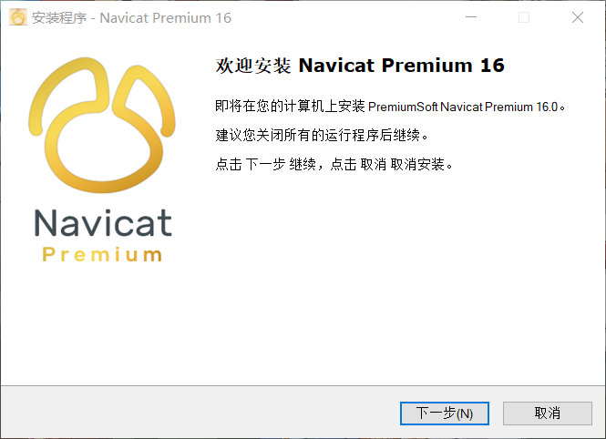
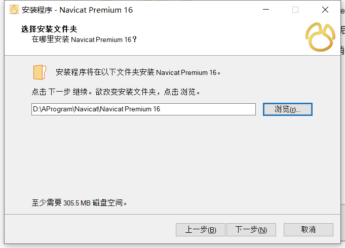
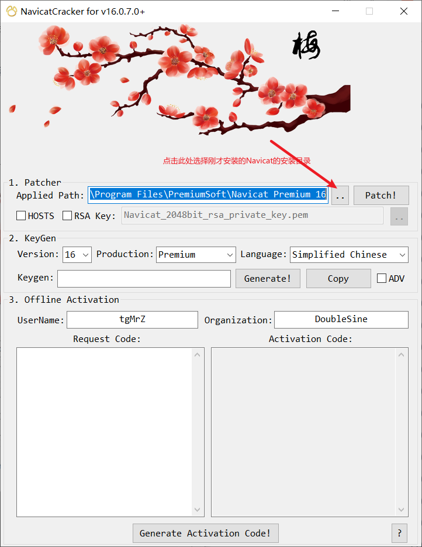
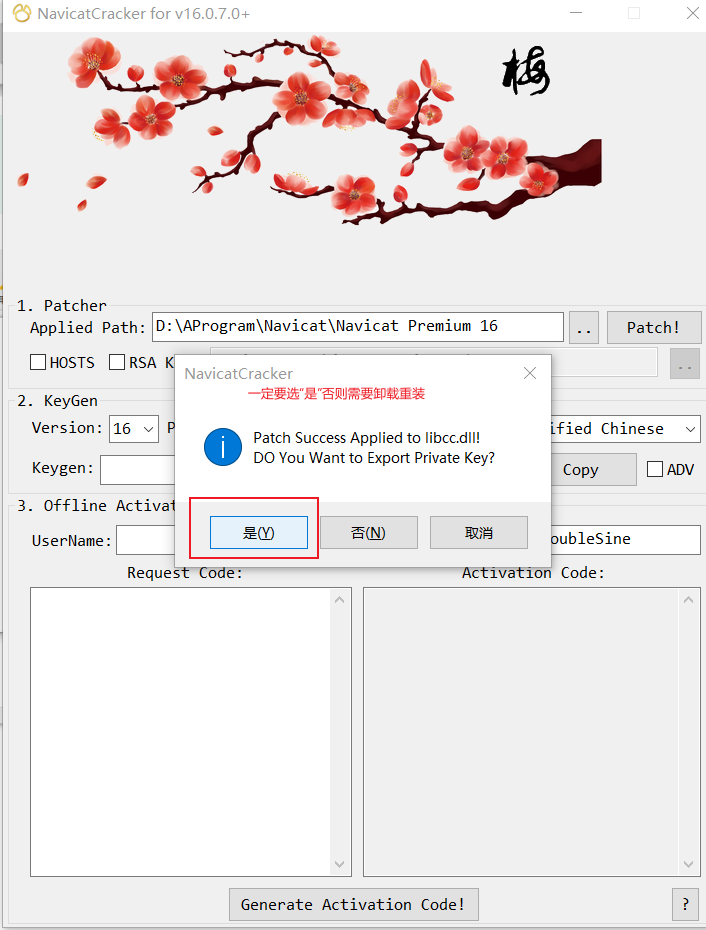
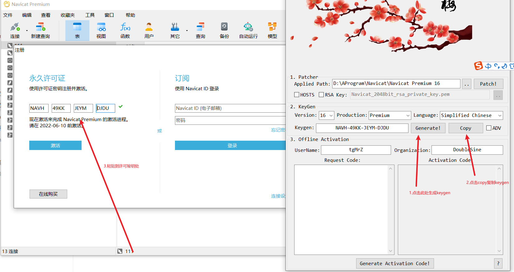
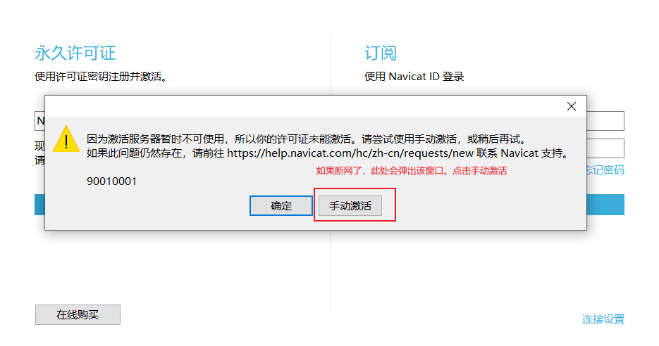
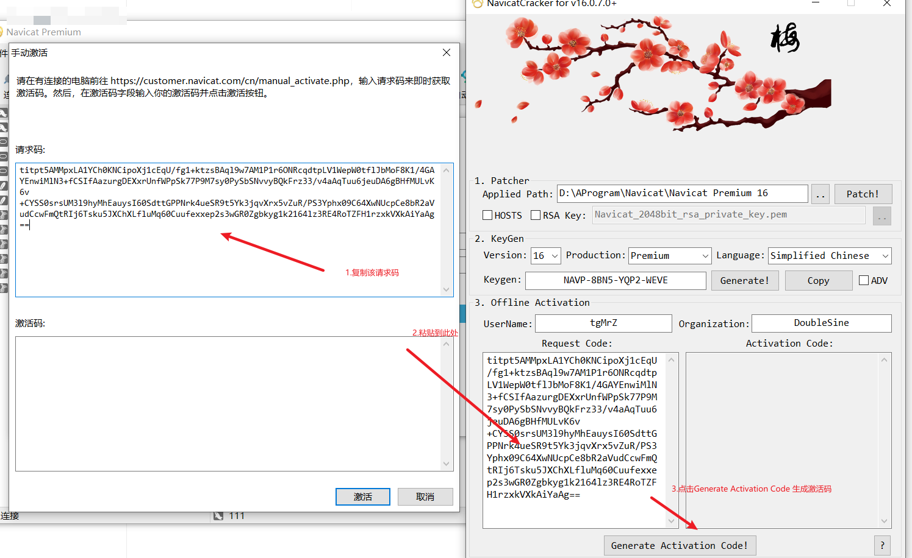
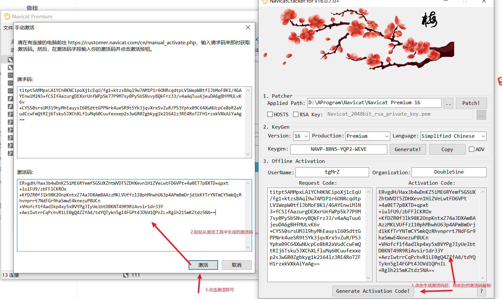
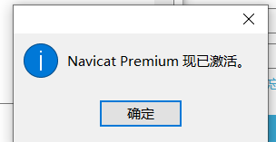

### 1.下载好后选择安装路径后直接下一步傻瓜式安装即可。

### 2.使用激活工具激活，双击打开

**此处一定要断网**

**此处一定要断网**

**此处一定要断网**

### 3.选择安装目录（目录一定要在navicat安装的根目录下，也就是instantclient_11_2文件夹的上一级）

### 4.点击Patch

### 5.然后**点击是**,请勿选择否,否则需要卸载，重装再来一次.

### 6.打开navicat的注册页面，打开激活工具，点击Generate生成Keygen，点击Copy，粘贴到navicat注册页面中！点击激活

### 7.点击手动激活

### 8.按图中步骤操作，即可激活成功

